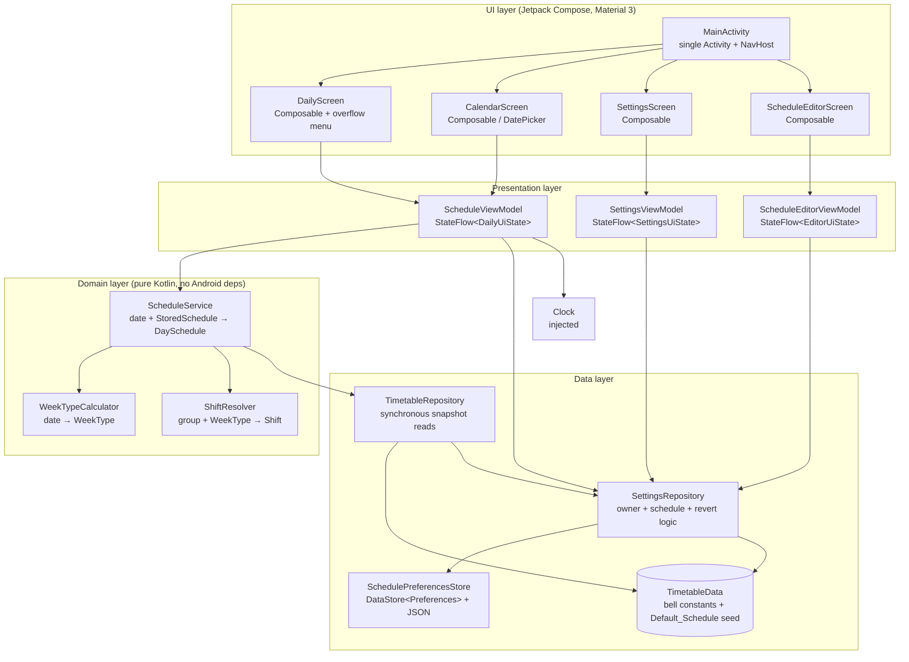

# Design Document

## Overview

This document describes the technical design for **school-timetable**, a single-user, fully offline native Android application that displays the personal teaching schedule of one primary school teacher (the **Owner**, an editable name that defaults to "Olivera"). The app runs on a personal Samsung Android device, is sideloaded (no Play Store, no account, no network), and for any selected calendar date shows the class/group codes taught per period together with the correct bell (clock) times. Because the Owner name, the class layout, and the day-to-group assignment are all user-editable and stored on the device (Features 2 & 3), the same build can be used by different teachers, each entering their own name and schedule.

The domain has two independent parts, mirrored directly in the design:

1. **A weekly class layout that is fixed week to week but user-editable.** The classes taught on each weekday never change from week to week; the same class codes always fall on the same weekday. Weekdays are partitioned into two groups: the *Parna group* (default Monday, Thursday, Friday) and the *Neparna group* (default Tuesday, Wednesday). As of Features 2 & 3, both the class layout and the day-to-group assignment are **user-editable and stored on the device** (Requirement 8); the constant tables now serve only as the seed used on first run. (Requirement 5.1, 5.2, 8)
2. **A weekly shift alternation.** Only the shift (morning vs afternoon) alternates. The two groups swap shifts each week. This is captured by a `WeekType` (A or B) computed deterministically from the date relative to the anchor Monday 2026-08-31. The Week_Type computation, the shift-alternation logic, and the bell times remain fixed and non-editable. (Requirement 2, 8.13)

For any date the app: resolves the weekday (which yields the stored period list and the stored group), computes the `WeekType` (which decides whether that group is on morning or afternoon shift that week), and renders each period with its class code and the bell times of the resolved shift. (Requirement 2.7)

Features 2 & 3 add three editable, device-local pieces of state — the **Owner** name (Requirement 7), the **Stored_Schedule** (the class layout + the group assignment, Requirement 8), and one retained **Previous_Schedule** for undo (Requirement 9) — persisted with **Jetpack DataStore**. The bell times remain compiled-in constants (fixed, not editable, Requirement 5.3, 5.4, 8.13). This shift from purely-constant data to a persisted, editable store is discussed in [Data source strategy](#data-source-strategy), which now also satisfies the store/persist/offline requirements (Requirement 5.5, 5.6, 7, 8, 9) with device-local I/O and no network.

### Key design decisions

| Decision | Choice | Rationale |
| --- | --- | --- |
| Language / UI | Kotlin + Jetpack Compose, Material 3 | Modern standard native Android stack; declarative UI fits the small, state-driven screens. |
| Architecture | Single-Activity, MVVM (ViewModel + StateFlow / Compose state) | Clean separation of pure domain logic from UI; testable. |
| Date math | `java.time` (`LocalDate`, `DayOfWeek`) | Correct, well-tested week arithmetic; deterministic. |
| Persistence (editable data) | **Preferences DataStore** storing a single kotlinx.serialization JSON blob | Small structured, device-local, offline data (owner + schedule + one previous schedule). No schema/migration ceremony; async but Flow-based. See [Data source strategy](#data-source-strategy). (Req 7, 8, 9) |
| Seed / defaults | `TimetableData.LESSONS` + `DAY_GROUP` constants remain in code as the **Default_Schedule** | First run seeds storage from these; also the reseed source if stored data is unreadable. (Req 8.1, 8.11) |
| Bell times | Remain hardcoded constants (`MORNING_BELLS` / `AFTERNOON_BELLS`) | Fixed and non-editable by requirement; no need to persist. (Req 5.3, 5.4, 8.13) |
| Min / target SDK | `minSdk 26`, `targetSdk` latest stable | `java.time` available natively at API 26; covers modern Samsung phones. If `minSdk < 26` were needed, enable core library desugaring. |
| Localization | Serbian day/shift labels via string resources | Teacher-facing labels (Ponedeljak, Utorak, ПРЕПОДНЕВНА/ПОПОДНЕВНА СМЕНА). Kept simple. |

## Architecture

The app is a single Activity hosting a Compose navigation graph. Prior to Features 2 & 3 there were two destinations (Daily view and Calendar view) sharing one `ScheduleViewModel`. Features 2 & 3 add two more destinations — the **Settings** screen (edit Owner, Requirement 7) and the **Schedule Editor** screen (edit the timetable + group assignment, and Revert, Requirements 8, 9) — reached from an overflow menu (⋮) on the Daily view. Business rules still live in a pure domain layer with no Android dependencies; the only new Android dependency is the DataStore-backed `SchedulePreferencesStore` in the data layer, which the ViewModels consume as a `Flow`.



Flow for rendering a date:
1. `ScheduleViewModel` collects the current `StoredSchedule` (and Owner) from `SettingsRepository` (a `Flow` backed by DataStore) and keeps the latest value as an in-memory snapshot; it holds the `selectedDate` and asks `ScheduleService` for that date's schedule using the snapshot.
2. `ScheduleService` resolves the `DayGroup` from the **stored** group assignment, calls `WeekTypeCalculator` for the `WeekType`, calls `ShiftResolver` to map (group, weekType) → `Shift`, reads the stored lessons for the weekday and the shift's bell times, and returns a fully resolved `DaySchedule`.
3. The ViewModel maps that into a `DailyUiState` the Composables render.
4. When the schedule is edited/saved or reverted, the DataStore `Flow` emits the new value, the snapshot refreshes, and the Daily view recomputes automatically (Requirement 8.12).

## Components and Interfaces

### WeekTypeCalculator

Pure function computing the `WeekType` for any date relative to the anchor. No Android or clock dependency — the date is passed in. (Requirement 2.1–2.4)

```kotlin
object WeekTypeCalculator {
    /** Monday of the anchor week; defined as WeekType.A. (Requirement: Anchor_Week) */
    val ANCHOR_MONDAY: LocalDate = LocalDate.of(2026, 8, 31)

    /** WeekType is deterministic for a given date. (Requirement 2.1, 2.3) */
    fun weekTypeFor(date: LocalDate): WeekType

    /** Absolute count of whole Mon–Sun weeks between date's Monday and the anchor Monday. */
    fun weeksFromAnchor(date: LocalDate): Long
}
```

### ShiftResolver

Maps a group and week type to a shift. (Requirement 2.5, 2.6)

```kotlin
object ShiftResolver {
    fun shiftFor(group: DayGroup, weekType: WeekType): Shift
}
```

### TimetableRepository

Provides the reads `ScheduleService` needs, backed by the **latest cached `StoredSchedule` snapshot** (for the editable lessons and group assignment) plus the compiled-in bell constants. Keeping these reads synchronous keeps `ScheduleService` pure and easily testable; the asynchronous DataStore access is confined to `SettingsRepository`, which pushes each new `StoredSchedule` into this repository's snapshot. Returns a `Result`-style outcome so the startup "data unavailable" path (Requirement 5.7, 8.11) is representable.

```kotlin
interface TimetableRepository {
    /** Ordered lessons for a weekday from the current StoredSchedule. Empty for weekends. (Req 5.1, 8.2) */
    fun lessonsFor(dayOfWeek: DayOfWeek): List<Lesson>

    /** Group assigned to a weekday in the current StoredSchedule. null for weekends. (Req 1.3, 8.3, 8.6) */
    fun groupFor(dayOfWeek: DayOfWeek): DayGroup?

    /** Bell times for a shift, keyed by period number — always from constants. (Req 5.3, 5.4, 8.13) */
    fun bellTimesFor(shift: Shift): Map<Int, BellTime>

    /** Verifies the timetable/bell data is loadable/consistent at startup. (Req 5.7) */
    fun load(): TimetableLoadResult
}

sealed interface TimetableLoadResult {
    data object Available : TimetableLoadResult
    data class Unavailable(val reason: String) : TimetableLoadResult
}
```

`ConstantTimetableRepository` (the existing impl) now reads its lessons and group assignment from a mutable, in-memory `StoredSchedule` snapshot that defaults to the `Default_Schedule` and is refreshed by `SettingsRepository` whenever DataStore emits a new value. `bellTimesFor` continues to return `TimetableData.MORNING_BELLS` / `AFTERNOON_BELLS` unchanged. `load()` retains its lightweight self-check (every non-weekend day's periods fall in 1–7 and every referenced period has a bell time for both shifts). Because the snapshot always holds valid data (either parsed storage or the reseeded `Default_Schedule`), `load()` still only surfaces `Unavailable` on a genuine consistency defect; the *storage-unreadable* case (Req 8.11) is handled in `SettingsRepository` (reseed + error indication) before the snapshot is ever populated with bad data.

### ScheduleService

Assembles a fully resolved schedule for a date by combining the stored lessons and stored group assignment with the resolved shift's bell times. It stays pure and synchronous: it reads through `TimetableRepository`'s snapshot getters and takes no suspend/`Flow` dependency. Group resolution now comes from `repository.groupFor(dayOfWeek)` (the stored `Group_Assignment`) rather than the top-level `DAY_GROUP` constant; `DAY_GROUP` is retained only as the default seed. (Requirement 1, 2.7, 2.8, 8.6, 8.12)

```kotlin
class ScheduleService(private val repository: TimetableRepository) {

    /** Full resolved schedule for one date: weekday, group, weekType, shift, and resolved lessons. */
    fun scheduleFor(date: LocalDate): DaySchedule
}
```

### SchedulePreferencesStore (DataStore)

Thin Android-facing wrapper over a Preferences `DataStore` holding one string key (`persisted_state`) whose value is the kotlinx.serialization JSON encoding of `PersistedState` (owner + current schedule + optional previous schedule). This is the only component that performs actual device-local I/O. (Requirement 5.5, 7.9, 8.14)

```kotlin
class SchedulePreferencesStore(private val dataStore: DataStore<Preferences>) {
    /** Emits the decoded PersistedState, or null when nothing/undecodable is stored. */
    val state: Flow<PersistedState?>          // maps a parse failure to a StoreReadFailure signal

    /** Serializes and writes the whole state atomically. Throws on write failure. (Req 8.9) */
    suspend fun write(state: PersistedState)
}
```

### SettingsRepository

Owns all editable state and the seed/reseed/revert rules; the single collaborator the three ViewModels talk to for persistence. It decodes the DataStore `Flow`, seeds the `Default_Schedule` on first run (Req 8.1) or reseeds it when stored data is unreadable/unparseable (Req 8.11), keeps `TimetableRepository`'s snapshot in sync, and exposes suspend mutators that enforce validation and the single-`Previous_Schedule` invariant. Bell times are never part of this repository. (Requirement 7, 8, 9)

```kotlin
class SettingsRepository(
    private val store: SchedulePreferencesStore,
    private val snapshotSink: (StoredSchedule) -> Unit   // updates TimetableRepository's snapshot
) {
    /** Owner + current schedule + whether a previous schedule exists, refreshed from DataStore. */
    val state: StateFlow<PersistedState>

    /** Seeds Default_Schedule/owner on first run; reseeds + flags an error on unreadable data. */
    suspend fun initialize(): InitOutcome        // Req 8.1, 8.11, 5.7

    // Owner (Req 7)
    suspend fun saveOwner(raw: String): OwnerSaveResult   // trims; validates 1..50; Req 7.3, 7.4, 7.7, 7.8

    // Schedule (Req 8) — replaces current, retains prior as Previous_Schedule
    suspend fun saveSchedule(edited: StoredSchedule): ScheduleSaveResult   // Req 8.8, 8.9, 9.1, 9.2

    // Revert (Req 9)
    suspend fun revert(): RevertResult           // restores + discards previous; no-op if none (Req 9.3, 9.4, 9.6)
}

sealed interface OwnerSaveResult { data object Saved: OwnerSaveResult; data object Empty: OwnerSaveResult; data object TooLong: OwnerSaveResult }
sealed interface ScheduleSaveResult { data object Saved: ScheduleSaveResult; data class WriteFailed(val reason: String): ScheduleSaveResult }
sealed interface RevertResult { data object Reverted: RevertResult; data object NoPrevious: RevertResult; data class WriteFailed(val reason: String): RevertResult }
sealed interface InitOutcome { data object Ok: InitOutcome; data object SeededDefault: InitOutcome; data object ReseededAfterCorruption: InitOutcome }
```

`saveSchedule` implements the Requirement 9 invariant purely: it builds the new `PersistedState` with `current = edited` and `previous = oldCurrent`, so at most one `Previous_Schedule` is ever retained and each save overwrites the last (Req 9.1, 9.2). `revert` sets `current = previous` and `previous = null` in one write, restoring and discarding atomically and leaving `owner` untouched (Req 9.3, 9.4, 9.5); with no previous it returns `NoPrevious` and writes nothing (Req 9.6). Both persist through `SchedulePreferencesStore.write`, so a write failure leaves the stored state unchanged and is surfaced as `WriteFailed` (Req 8.9).

### ScheduleViewModel

Holds the selected date and exposes UI state. Takes an injected `Clock` so "today" is deterministic in tests, and now also takes `SettingsRepository` so it can react to schedule/owner changes. It collects `SettingsRepository.state`; each emission refreshes the in-memory snapshot (via the snapshot sink wired into `TimetableRepository`) and recomputes the current `DailyUiState`, so an edit/save/revert is reflected in the Daily view automatically (Requirement 8.12). (Requirement 3, 4, 6.2, 6.4, 8.12)

```kotlin
class ScheduleViewModel(
    private val scheduleService: ScheduleService,
    private val settingsRepository: SettingsRepository,
    private val clock: Clock = Clock.systemDefaultZone()
) : ViewModel() {

    val uiState: StateFlow<DailyUiState>   // recomputes when selectedDate OR StoredSchedule changes

    fun initToToday()          // Req 3.1, 6.2; falls back on failure per Req 6.4
    fun nextDay()              // Req 3.2
    fun previousDay()          // Req 3.3
    fun selectDate(date: LocalDate)   // Req 4.2
}
```

### SettingsViewModel

Backs the Settings screen: exposes the current Owner and validation feedback, and saves through `SettingsRepository.saveOwner`, which trims and validates. (Requirement 7)

```kotlin
class SettingsViewModel(private val settingsRepository: SettingsRepository) : ViewModel() {
    val uiState: StateFlow<SettingsUiState>   // current owner, editing text, error

    fun onOwnerTextChanged(text: String)
    fun saveOwner()   // Req 7.3, 7.4, 7.7, 7.8 — maps OwnerSaveResult to SettingsUiState.error
}

data class SettingsUiState(
    val storedOwner: String,
    val editingText: String,
    val error: OwnerError? = null
)

enum class OwnerError { EMPTY, TOO_LONG }
```

### ScheduleEditorViewModel

Backs the Schedule Editor. Holds a **working copy** of the `StoredSchedule` (initialized from the current stored value) so the on-device data is untouched until save (Req 8.7). Exposes per-weekday period edits and the group toggle, a Save (persist working copy, retaining prior as previous), and a Revert. (Requirement 8, 9)

```kotlin
class ScheduleEditorViewModel(private val settingsRepository: SettingsRepository) : ViewModel() {
    val uiState: StateFlow<EditorUiState>   // working copy + hasPrevious + save/revert feedback

    fun onClassCodeChanged(day: DayOfWeek, period: Int, text: String)  // trims; blank => Pause (Req 8.4, 8.5)
    fun onGroupToggled(day: DayOfWeek, group: DayGroup)                 // Req 8.6
    fun save()      // Req 8.8, 8.9, 9.1, 9.2
    fun revert()    // Req 9.3, 9.4, 9.6
}

data class EditorUiState(
    val working: StoredSchedule,          // Mon–Fri, periods 1..7 each editable
    val hasPrevious: Boolean,             // enables/labels Revert; drives Req 9.6 message
    val classCodeErrors: Map<Pair<DayOfWeek, Int>, ClassCodeError> = emptyMap(),
    val saveError: String? = null,        // Req 8.9
    val notice: EditorNotice? = null      // e.g. NO_PREVIOUS after a no-op revert (Req 9.6)
)

enum class ClassCodeError { TOO_LONG }   // >20 chars after trim (Req 8.4)
enum class EditorNotice { SAVED, REVERTED, NO_PREVIOUS }
```

The editor presents each weekday's periods 1..7 (Req 8.2), showing the current class code or an empty field for a Pause; a class code is trimmed and accepted when 1..20 chars (Req 8.4), and a blank/whitespace field becomes a Pause (Req 8.5). A per-weekday **ПАРНА/НЕПАРНА** toggle edits the group assignment (Req 8.3, 8.6). Save persists the whole working copy — including weekdays whose periods are all Pause (Req 8.8) — and Revert restores the previous schedule or shows the "no previous schedule" notice (Req 9.6).

### Composable screens

- **`DailyScreen`** — renders `DailyUiState`: weekday + group label (Req 1.3), shift label (Req 1.4), ordered period rows with number, class code and times (Req 1.1, 1.2), pause rows (Req 1.5), weekend / no-class messages (Req 1.6, 1.7), and prev/next controls (Req 3.2, 3.3). Its top app bar now carries an **overflow menu (⋮)** with two items — **"Подешавања"** (Settings) and **"Измени распоред"** (Edit schedule) — that navigate to the Settings and Schedule Editor destinations. (Requirement 1, 3, 7, 8)
- **`CalendarScreen`** — a Material 3 `DatePicker` (or month grid) defaulting to the selected date's month (Req 4.1), marking the selected date (Req 4.3), and returning the chosen date to the ViewModel (Req 4.2, 4.4, 4.5). (Requirement 4)
- **`SettingsScreen`** — shows the current Owner in an editable text field (Req 7.2, 7.6), a Save action, and inline validation messages for empty (Req 7.7) and over-50-character (Req 7.8) input; on success the stored value is shown within the save budget (Req 7.4). (Requirement 7)
- **`ScheduleEditorScreen`** — for each weekday Monday–Friday, seven period rows (1..7) with an editable class-code text field (blank = Pause) and a **ПАРНА/НЕПАРНА** group toggle (Req 8.2, 8.3, 8.4, 8.5, 8.6); a **Save** button (Req 8.8, 8.9) and a **Revert** button (Req 9.3, 9.6). Editing mutates only the working copy until Save (Req 8.7). (Requirement 8, 9)

### Navigation

`MainActivity`'s single `NavHost` gains two routes in addition to `daily` and `calendar`: `settings` and `editor`. The Daily screen's overflow menu navigates to `settings` / `editor`; both new screens have an up/back affordance returning to Daily. `ScheduleViewModel` remains the shared Daily/Calendar ViewModel; `SettingsViewModel` and `ScheduleEditorViewModel` are scoped to their destinations via `viewModelFactory` and share the single `SettingsRepository`, so a save on either screen propagates to the Daily view through the DataStore `Flow`.

## Data Models

All domain types are plain Kotlin with no Android dependency.

```kotlin
enum class WeekType { A, B }

enum class DayGroup { PARNA, NEPARNA }

enum class Shift { MORNING, AFTERNOON }

/** A fixed lesson slot for a weekday. classCode == null means a Pause / free period. (Req 1.5, 5.1) */
data class Lesson(
    val period: Int,          // 1..7
    val classCode: String?    // e.g. "5/4"; null => Pause
) {
    val isPause: Boolean get() = classCode == null
}

/** Bell (clock) times for a period within a shift. (Req 5.3, 5.4) */
data class BellTime(
    val period: Int,
    val start: LocalTime,
    val end: LocalTime
)

/** A lesson combined with the resolved shift's bell times. (Req 1.1) */
data class ResolvedLesson(
    val period: Int,
    val classCode: String?,   // null => Pause
    val start: LocalTime,
    val end: LocalTime
) {
    val isPause: Boolean get() = classCode == null
}

/** Fully resolved schedule for one date. */
data class DaySchedule(
    val date: LocalDate,
    val dayOfWeek: DayOfWeek,
    val isWeekend: Boolean,
    val group: DayGroup?,           // null on weekends
    val weekType: WeekType,
    val shift: Shift?,              // null on weekends
    val lessons: List<ResolvedLesson> // empty on weekends / no-class weekdays
)
```

UI-facing state:

```kotlin
data class DailyUiState(
    val date: LocalDate,
    val headerLabel: String,        // localized weekday, e.g. "Ponedeljak"
    val groupLabel: String?,        // "Parna" / "Neparna"
    val shiftLabel: String?,        // ПРЕПОДНЕВНА / ПОПОДНЕВНА СМЕНА
    val lessons: List<ResolvedLesson>,
    val message: DailyMessage?      // WEEKEND, NO_CLASSES, DATA_UNAVAILABLE, DATE_UNDETERMINED
)

enum class DailyMessage { WEEKEND, NO_CLASSES, DATA_UNAVAILABLE, DATE_UNDETERMINED }
```

### Persisted, editable models (Features 2 & 3) — Requirements 7, 8, 9

The editable data is modeled as plain serializable Kotlin (kotlinx.serialization). `DayOfWeek` and the `DayGroup`/`Shift` enums serialize by name; `classCode == null` continues to mean a Pause, which serializes as JSON `null`. These types live in the domain layer (pure Kotlin) so the seed/revert logic stays unit-testable independent of Android/DataStore.

```kotlin
/** The user-editable schedule: class layout + group assignment for Mon–Fri. (Req 8.1, 8.2, 8.3) */
@Serializable
data class StoredSchedule(
    // Ordered lessons per weekday; classCode == null => Pause. Bell times are NOT stored here.
    val lessonsByDay: Map<DayOfWeek, List<Lesson>>,
    // Group assignment per weekday (Parna/Neparna). Editable. (Req 8.6)
    val groupByDay: Map<DayOfWeek, DayGroup>
)

/** The full device-local persisted state: owner + current schedule + at most one previous. */
@Serializable
data class PersistedState(
    val owner: String,                       // Req 7; default "Olivera"
    val current: StoredSchedule,             // the live schedule (Req 8)
    val previous: StoredSchedule? = null     // single Previous_Schedule for Revert (Req 9.1, 9.2)
)
```

Notes:
- `Lesson` (already defined above) is `@Serializable`; a `LocalDate`/`LocalTime` never appears in the persisted model, so no custom `java.time` serializers are needed — keys are `DayOfWeek` names and values are period/class-code pairs.
- The whole `PersistedState` is stored as one JSON string under a single Preferences key, so writes are atomic (a save or revert replaces the entire blob), which is what makes the Requirement 9 single-previous invariant trivial to guarantee.

### Default group assignment (seed only)

`DAY_GROUP` is now the **default** group assignment used to build the `Default_Schedule`'s `groupByDay`; at runtime the group is read from the stored `StoredSchedule.groupByDay`, not from this constant. (Requirement 8.1, 8.3)

```kotlin
/** Default seed for Group_Assignment; the live value is stored and editable. (Req 8.1) */
val DAY_GROUP: Map<DayOfWeek, DayGroup> = mapOf(
    DayOfWeek.MONDAY    to DayGroup.PARNA,
    DayOfWeek.THURSDAY  to DayGroup.PARNA,
    DayOfWeek.FRIDAY    to DayGroup.PARNA,
    DayOfWeek.TUESDAY   to DayGroup.NEPARNA,
    DayOfWeek.WEDNESDAY to DayGroup.NEPARNA
    // Saturday, Sunday: no group (weekend)
)

/** Default_Schedule seed built from the constants; used on first run and on reseed. (Req 8.1, 8.11) */
val DEFAULT_SCHEDULE: StoredSchedule = StoredSchedule(
    lessonsByDay = TimetableData.LESSONS.filterKeys { it != DayOfWeek.SATURDAY && it != DayOfWeek.SUNDAY },
    groupByDay = DAY_GROUP
)

/** Default owner on first run. (Req 7.1) */
const val DEFAULT_OWNER: String = "Olivera"
```

### Hardcoded timetable (period → class code; null = Pause) — Requirement 5.2 (now the seed)

```kotlin
object TimetableData {

    val LESSONS: Map<DayOfWeek, List<Lesson>> = mapOf(
        DayOfWeek.MONDAY to listOf(
            Lesson(6, "5/4"), Lesson(7, "5/2")
        ),
        DayOfWeek.TUESDAY to listOf(
            Lesson(2, "6/1"), Lesson(3, "8/5"), Lesson(4, "6/3"),
            Lesson(5, "6/5"), Lesson(6, "7/1"), Lesson(7, "7/5")
        ),
        DayOfWeek.WEDNESDAY to listOf(
            Lesson(1, "7/3"), Lesson(2, "5/3"), Lesson(3, "8/1"),
            Lesson(4, null),  Lesson(5, "6/7"), Lesson(6, "8/7")   // period 4 = Pause
        ),
        DayOfWeek.THURSDAY to listOf(
            Lesson(1, "6/4"), Lesson(2, "6/2"), Lesson(3, "6/6"),
            Lesson(4, "8/4"), Lesson(5, null),  Lesson(6, "7/4"),  // period 5 = Pause
            Lesson(7, "7/2")
        ),
        DayOfWeek.FRIDAY to listOf(
            Lesson(4, "7/6"), Lesson(5, "8/2"), Lesson(6, "8/6"), Lesson(7, "7/7")
        ),
        DayOfWeek.SATURDAY to emptyList(),
        DayOfWeek.SUNDAY to emptyList()
    )

    // Morning shift bell times. (Req 5.3)
    val MORNING_BELLS: Map<Int, BellTime> = mapOf(
        1 to BellTime(1, LocalTime.of(8, 0),  LocalTime.of(8, 45)),
        2 to BellTime(2, LocalTime.of(8, 50), LocalTime.of(9, 35)),
        3 to BellTime(3, LocalTime.of(9, 55), LocalTime.of(10, 40)),
        4 to BellTime(4, LocalTime.of(10, 45), LocalTime.of(11, 30)),
        5 to BellTime(5, LocalTime.of(11, 35), LocalTime.of(12, 20)),
        6 to BellTime(6, LocalTime.of(12, 25), LocalTime.of(13, 10)),
        7 to BellTime(7, LocalTime.of(13, 15), LocalTime.of(14, 0))
    )

    // Afternoon shift bell times. (Req 5.4)
    val AFTERNOON_BELLS: Map<Int, BellTime> = mapOf(
        1 to BellTime(1, LocalTime.of(14, 0),  LocalTime.of(14, 45)),
        2 to BellTime(2, LocalTime.of(14, 50), LocalTime.of(15, 35)),
        3 to BellTime(3, LocalTime.of(15, 55), LocalTime.of(16, 40)),
        4 to BellTime(4, LocalTime.of(16, 45), LocalTime.of(17, 30)),
        5 to BellTime(5, LocalTime.of(17, 35), LocalTime.of(18, 20)),
        6 to BellTime(6, LocalTime.of(18, 25), LocalTime.of(19, 10)),
        7 to BellTime(7, LocalTime.of(19, 15), LocalTime.of(20, 0))
    )
}
```

### Data source strategy

**Original decision (Features 1, retained for context).** The initial requirements described a *fixed* timetable and *fixed* bell times (Requirement 5.1–5.4) with no editing feature. Three options were considered:

- **Room database** — supports mutation and queries, but adds a schema, migrations, an I/O layer, and asynchronous access for data that is constant. Overkill; the persistence guarantee (Req 5.6) would depend on correct DB setup that could actually fail.
- **DataStore / preferences** — meant for small mutable key-value settings, not structured relational schedule data.
- **Hardcoded in-code constants (chosen at the time)** — the tables live in `TimetableData` compiled into the APK. They are inherently offline (Req 5.5), survive restarts unchanged with zero effort (Req 5.6), and cannot be partially corrupted at runtime.

That choice was correct *given the premise that the data was fixed*.

**Revised decision (Features 2 & 3).** That premise no longer holds. Requirement 7 makes the **Owner** editable, Requirement 8 makes the **timetable and group assignment** editable, and Requirement 9 requires retaining one **Previous_Schedule** for undo — all of which must persist across restarts on-device (Req 7.5, 8.10, 9.7). Editability changes the tradeoff: constants alone can no longer hold the live data, so a device-local persistence layer is now required. Re-evaluating the same options:

- **Room** — still heavier than needed. The editable state is a single small object graph (owner + one current schedule + one previous schedule), not a queryable relational dataset; a schema + migrations add risk and ceremony for no query benefit.
- **Proto DataStore** — type-safe and a good fit, but requires defining and maintaining a `.proto` schema and generated code.
- **Preferences DataStore storing a kotlinx.serialization JSON blob (chosen)** — the whole `PersistedState` is serialized to one JSON string under a single Preferences key. This keeps the model in ordinary Kotlin data classes (no `.proto`, no schema migration ceremony), gives atomic whole-state writes (which makes the Requirement 9 single-previous invariant trivial), is device-local and offline (Req 5.5, 8.14), and integrates cleanly as a `Flow` the ViewModels observe. Chosen over Proto for simplicity given the tiny, self-contained payload.

**Seed and reseed.** `TimetableData.LESSONS` + `DAY_GROUP` remain compiled in, but now as the **Default_Schedule** seed rather than the live data. On first run (no stored value) `SettingsRepository.initialize()` seeds storage from `DEFAULT_SCHEDULE`/`DEFAULT_OWNER` and writes it (Req 8.1, 7.1). If a stored value exists but cannot be read or parsed, `initialize()` reseeds from `Default_Schedule` and flags an error indication (Req 8.11); the reseed replaces only the unreadable blob. **Bell times stay hardcoded** (`MORNING_BELLS`/`AFTERNOON_BELLS`) and are never persisted, matching the fixed/non-editable requirement (Req 5.3, 5.4, 8.13).

**Startup consistency self-check.** `TimetableRepository.load()` keeps its lightweight self-check (every non-weekend day's referenced periods fall in 1–7, every referenced period has a bell time for both shifts) and returns `Unavailable` on a genuine consistency defect so the UI shows the data-unavailable indication rather than crashing (Req 5.7). This is distinct from the storage-unreadable path (Req 8.11), which `SettingsRepository` handles by reseeding before the snapshot is populated. No new permissions are added; all reads/writes are device-local (Req 8.14).

## Week type and shift resolution algorithm

### Computing WeekType (Requirement 2.1–2.4)

```kotlin
fun weeksFromAnchor(date: LocalDate): Long {
    // Monday of the given date's week (java.time weeks start Monday). (Req 2.2)
    val mondayOfDate = date.with(TemporalAdjusters.previousOrSame(DayOfWeek.MONDAY))
    // Absolute whole-week distance from the anchor Monday; handles dates before the anchor.
    val days = ChronoUnit.DAYS.between(ANCHOR_MONDAY, mondayOfDate) // may be negative
    return Math.floorDiv(days, 7).let { Math.abs(it) }             // absolute week count (Req 2.1)
}

fun weekTypeFor(date: LocalDate): WeekType =
    if (weeksFromAnchor(date) % 2 == 0L) WeekType.A else WeekType.B
```

Notes:
- Because both operands are Mondays, `days` is always a multiple of 7, so `floorDiv(days, 7)` is exact in both directions and equals the signed whole-week offset. Taking the absolute value gives an absolute week count that is symmetric around the anchor and defines the anchor week (offset 0) as `A`. (Requirement 2.1)
- The function depends only on `date`, so the same date always yields the same value. (Requirement 2.3)
- Two dates one week apart differ by exactly one in the week count, so their parity — and thus `WeekType` — is always opposite. (Requirement 2.4)

### Mapping to shift (Requirement 2.5, 2.6)

```kotlin
fun shiftFor(group: DayGroup, weekType: WeekType): Shift = when (weekType) {
    WeekType.A -> if (group == DayGroup.PARNA) Shift.MORNING else Shift.AFTERNOON
    WeekType.B -> if (group == DayGroup.PARNA) Shift.AFTERNOON else Shift.MORNING
}
```

### Assembling a day (Requirement 1, 2.7, 2.8)

```kotlin
fun scheduleFor(date: LocalDate): DaySchedule {
    val dow = date.dayOfWeek
    val weekType = WeekTypeCalculator.weekTypeFor(date)
    val isWeekend = dow == DayOfWeek.SATURDAY || dow == DayOfWeek.SUNDAY
    if (isWeekend) {
        return DaySchedule(date, dow, true, group = null, weekType, shift = null, lessons = emptyList())
    }
    val group = repository.groupFor(dow)!!                 // stored Group_Assignment (Req 8.6); non-null Mon–Fri
    val shift = ShiftResolver.shiftFor(group, weekType)
    val bells = repository.bellTimesFor(shift)              // Req 2.7 applies shift bell times (from constants)
    val lessons = repository.lessonsFor(dow)               // fixed, WeekType-independent (Req 2.8)
        .sortedBy { it.period }                            // ascending order (Req 1.2)
        .map { l ->
            val b = bells.getValue(l.period)
            ResolvedLesson(l.period, l.classCode, b.start, b.end)
        }
    return DaySchedule(date, dow, false, group, weekType, shift, lessons)
}
```

The class codes come only from `repository.lessonsFor(dow)` (the current `StoredSchedule`), which does not depend on `weekType`; only `bells` depends on the resolved shift. This structurally guarantees Requirement 2.8 (class codes identical across week types; only times differ). The group comes from `repository.groupFor(dow)` (the stored `Group_Assignment`), so an edited group takes effect immediately in the Daily view (Req 8.12) while remaining fixed within any given week.

## Daily view behavior

- **Default to today.** On launch the ViewModel sets `selectedDate` to `LocalDate.now(clock)` and renders that date within the launch budget. (Requirement 3.1, 6.2)
- **Navigation.** `nextDay()` / `previousDay()` shift `selectedDate` by ±1 day and recompute the full `DaySchedule`, updating periods, class codes, shift times, and the weekday/group/shift labels. (Requirement 3.2, 3.3, 3.4)
- **Weekend.** When the resolved date is Saturday or Sunday, the view shows a "no classes scheduled" message and omits the period list, while retaining the selected date. (Requirement 1.6, 3.5, 6.3)
- **Weekday with no periods.** If a weekday has an empty lesson list, the view shows the no-classes message. (Requirement 1.7) (This is now reachable in practice: the Teacher may edit a weekday so that all seven periods are Pause, which is a valid saved schedule per Req 8.8; the branch is handled generically.)
- **Reflecting edits.** Because the Daily state is recomputed from the current `StoredSchedule` snapshot (refreshed by the DataStore `Flow`), an edit/save or revert is reflected in the Daily view without any manual reload. (Requirement 8.12)
- **Pause.** Pause periods (`classCode == null`) render with their period number and clock times plus a visible "no class / pause" indication, in order among the other periods. (Requirement 1.5)
- **Labels.** The header shows the localized weekday and the group (Parna/Neparna); a separate label shows morning vs afternoon shift. (Requirement 1.3, 1.4)

## Calendar browsing behavior

- Opening the calendar shows a Material 3 date picker defaulting to the month of the current `selectedDate`. (Requirement 4.1)
- The currently selected date is visually marked. (Requirement 4.3)
- Selecting a date sets `selectedDate` and returns to the Daily view for that date, computed synchronously in-memory (well within the 1-second budget). (Requirement 4.2)
- The Daily view then shows the weekday, group, and shift label for the chosen date; a weekend selection shows the no-classes message and retains the date. (Requirement 4.4, 4.5)

## Correctness Properties

*A property is a characteristic or behavior that should hold true across all valid executions of a system — essentially, a formal statement about what the system should do. Properties serve as the bridge between human-readable specifications and machine-verifiable correctness guarantees.*

The domain layer (WeekType calculation, shift resolution, schedule assembly) and the editable-state logic (owner validation, JSON serialization round-trips, and the seed/save/revert rules in `SettingsRepository` over an in-memory/fake store) consist of pure functions over dates, strings, and small serializable models, making them well suited to property-based testing. Each property below is universally quantified and can be encoded directly as a PBT test with a generator over `LocalDate`, `String`, `StoredSchedule`/`PersistedState`, and `DayGroup`/`WeekType` where relevant. Properties 1–5 and 7–10 are unchanged by Features 2 & 3; Property 6 is reframed to quantify over the stored `Group_Assignment`; Properties 11–16 cover the new editable-state behavior (Requirements 7, 8, 9).

### Property 1: WeekType is deterministic and follows even/odd week parity

*For any* `LocalDate`, `weekTypeFor(date)` returns `A` when `weeksFromAnchor(date)` is even and `B` when it is odd, and repeated computations for the same date (including from freshly constructed instances) always return the same value. The anchor Monday 2026-08-31 and every date in its Mon–Sun week are `A`.

**Validates: Requirements 2.1, 2.3**

### Property 2: Dates in the same Monday–Sunday week share one WeekType

*For any* `LocalDate` and any day offset in `0..6` that keeps the date within the same Monday-to-Sunday week, both dates yield the same `WeekType`.

**Validates: Requirements 2.2**

### Property 3: Consecutive weeks alternate WeekType

*For any* `LocalDate`, `weekTypeFor(date)` and `weekTypeFor(date.plusWeeks(1))` are different (one `A`, one `B`).

**Validates: Requirements 2.4**

### Property 4: Shift resolution and bell-time application are correct

*For any* Monday-through-Friday `LocalDate`, letting `group = DAY_GROUP[dayOfWeek]` and `wt = weekTypeFor(date)`: the resolved shift equals `MORNING` exactly when (`group == PARNA` and `wt == A`) or (`group == NEPARNA` and `wt == B`), otherwise `AFTERNOON`; and every `ResolvedLesson`'s `start`/`end` equal the `BellTime` of that period for the resolved shift.

**Validates: Requirements 2.5, 2.6, 2.7, 1.1**

### Property 5: Class codes are invariant across WeekTypes; only times change

*For any* Monday-through-Friday weekday, the ordered sequence of `classCode` values in the resolved schedule is identical whether the date falls in a `WeekType.A` week or a `WeekType.B` week, while the set of clock times differs between the two.

**Validates: Requirements 2.8**

### Property 6: Group membership follows the current stored assignment and is fixed within a week

*For any* current `StoredSchedule` and *any* Monday-through-Friday `LocalDate`, the resolved `DaySchedule.group` equals `storedSchedule.groupByDay[dayOfWeek]` — the current stored `Group_Assignment` — and is independent of the date's week (it changes only when the stored assignment is edited). With the `Default_Schedule` seed this is Monday/Thursday/Friday → Parna and Tuesday/Wednesday → Neparna, but the property now quantifies over whatever assignment is currently stored rather than the hardcoded `DAY_GROUP` map. After an edit-and-save, the Daily view reflects the new assignment (Req 8.12).

**Validates: Requirements 1.3, 8.6, 8.12**

### Property 7: Resolved lessons are ascending and preserve pauses

*For any* Monday-through-Friday `LocalDate`, the resolved lessons are ordered by strictly ascending period number, and every resolved lesson whose source `classCode` is `null` has `isPause == true` while still carrying valid `start`/`end` times.

**Validates: Requirements 1.2, 1.5**

### Property 8: Weekend days yield no lessons

*For any* `LocalDate` that is a Saturday or Sunday, the resolved `DaySchedule` has `isWeekend == true`, an empty `lessons` list, and a null `group`/`shift`.

**Validates: Requirements 1.6, 3.5, 4.5, 6.3**

### Property 9: Day navigation round-trips to the same schedule

*For any* starting `LocalDate`, advancing one day and then going back one day (or the reverse) returns a `DaySchedule` equal to the original date's schedule; a single `nextDay`/`previousDay` step produces exactly the schedule of `date ± 1` with matching weekday, group, and shift.

**Validates: Requirements 3.2, 3.3, 3.4, 4.2**

### Property 10: Timetable data reads are idempotent

*For any* `DayOfWeek` (and any `Shift`), repeated calls to `lessonsFor` (and `bellTimesFor`), including across freshly constructed repository instances, return equal results — modeling that the stored data survives restarts unchanged.

**Validates: Requirements 5.6**

### Property 11: Owner validation trims and enforces the 1–50 length bound

*For any* input `String`, `saveOwner` first trims leading/trailing whitespace, then: if the trimmed length is in `1..50` it stores the trimmed value and reports success (the stored owner becomes exactly the trimmed input); if the trimmed length is `0` it reports the empty error and leaves the stored owner unchanged; if the trimmed length exceeds `50` it reports the too-long error and leaves the stored owner unchanged.

**Validates: Requirements 7.3, 7.4, 7.7, 7.8**

### Property 12: Persisted state round-trips through storage unchanged

*For any* `PersistedState` (any owner in `1..50`, any `current` `StoredSchedule`, and `previous` either absent or any `StoredSchedule`), serializing it to JSON and deserializing it back — including reading it from a freshly constructed store over the same backing, modeling a restart — yields an equal `PersistedState`, preserving the owner, the current class codes / pauses / group assignment, and the previous schedule.

**Validates: Requirements 7.5, 8.10, 9.7**

### Property 13: Editor edits produce the expected working copy

*For any* working `StoredSchedule`, any weekday in Monday–Friday, and any period in `1..7`: setting the class-code field to a string whose trimmed length is in `1..20` updates that period's `classCode` to the trimmed value; setting it to an empty or all-whitespace string sets that period to a Pause (`classCode == null`); and toggling the weekday's group to a chosen `DayGroup` sets `groupByDay[weekday]` to that value. All other entries are left unchanged.

**Validates: Requirements 8.4, 8.5, 8.6**

### Property 14: Editing leaves the stored schedule untouched until save

*For any* initial stored `StoredSchedule` and *any* sequence of editor edits applied to the working copy without a save, the `StoredSchedule` persisted on the device remains equal to the initial stored value.

**Validates: Requirements 8.7**

### Property 15: Save retains one previous; revert restores and discards it; owner is unaffected

*For any* starting `PersistedState` and *any* edited `StoredSchedule` `E`: after `saveSchedule(E)`, `current == E` (including weekdays that are all Pause) and `previous` equals the `current` value from immediately before the save, and at most one previous is retained across any sequence of saves (each save overwrites the earlier previous). *For any* state with a non-null `previous P`, `revert` sets `current == P` and `previous == null`, leaves `owner` unchanged, and a second consecutive `revert` (with no intervening save) finds no previous to restore.

**Validates: Requirements 8.8, 9.1, 9.2, 9.3, 9.4, 9.5**

### Property 16: Seeding is idempotent

*For any* store state, running `initialize()` when a valid `Stored_Schedule` already exists leaves the stored owner and schedule unchanged (it seeds the `Default_Schedule`/default owner only when nothing readable is stored), so initializing an already-seeded store is a no-op.

**Validates: Requirements 8.1**

## Error Handling

| Condition | Detection | Handling | Requirement |
| --- | --- | --- | --- |
| System date cannot be determined at launch | `initToToday()` catches an exception from reading `LocalDate.now(clock)` | Set a `DATE_UNDETERMINED` indication and default `selectedDate` to the most recent weekday (Mon–Fri) on/before the last known date; render its Daily view | 6.4 |
| Selected date is a weekend | `dayOfWeek` is Saturday/Sunday | Show `WEEKEND` no-classes message, omit the period list, retain the selected date | 1.6, 3.5, 4.5, 6.3 |
| Weekday has no period entry | Empty lesson list for the weekday | Show `NO_CLASSES` message | 1.7 |
| Bell/consistency data fails self-check at startup | `TimetableRepository.load()` self-check returns `Unavailable` | Show `DATA_UNAVAILABLE` indication; do not overwrite data (nothing to persist/lose) | 5.7 |
| Owner name empty after trim | `saveOwner` sees trimmed length 0 | Return `OwnerSaveResult.Empty`; retain stored owner; show "name cannot be empty" in Settings | 7.7 |
| Owner name exceeds 50 chars after trim | `saveOwner` sees trimmed length > 50 | Return `OwnerSaveResult.TooLong`; retain stored owner; show "name must be 50 characters or fewer" | 7.8 |
| Class code exceeds 20 chars after trim | Editor field validation | Flag `ClassCodeError.TOO_LONG` on that period; do not accept the value into the working copy | 8.4 |
| Schedule save write fails | `SchedulePreferencesStore.write` throws → `ScheduleSaveResult.WriteFailed` | Retain the previous `Stored_Schedule` unchanged; show a save-failed error indication | 8.9 |
| Stored schedule exists but unreadable/unparseable | `SettingsRepository.initialize()` cannot decode the JSON blob | Reseed from `Default_Schedule`, persist it, and show "previous schedule could not be loaded" (`InitOutcome.ReseededAfterCorruption`) | 8.11 |
| Revert with no `Previous_Schedule` | `revert()` sees `previous == null` | Return `RevertResult.NoPrevious`; leave current `Stored_Schedule` unchanged; show "no previous schedule available" (`EditorNotice.NO_PREVIOUS`) | 9.6 |

Guiding principles:
- The domain layer never throws for ordinary inputs — weekends and empty weekdays are represented as valid `DaySchedule` states, not errors.
- Only genuinely exceptional conditions (clock failure, failed data self-check, storage read/write failure) produce an error indication, and each keeps the app usable rather than crashing (Requirement 6.2 launch must still succeed).
- Validation failures (owner empty/too long, class code too long) and the no-previous revert are ordinary, non-fatal outcomes surfaced as UI messages that leave stored data unchanged (Req 7.7, 7.8, 8.9, 9.6).

## Testing Strategy

A dual approach: property-based tests verify the universal domain rules; example/unit tests pin down concrete data values and specific branches; Compose UI tests verify rendering.

**Property-based tests (domain + editable-state logic).** Use **Kotest property testing** (`io.kotest:kotest-property`) with a custom `Arb<LocalDate>` generator spanning a wide range around the anchor (including dates well before 2026-08-31 to exercise the absolute-week-count path), plus generators for `String` (owner and class-code inputs, including whitespace-heavy and boundary-length cases), `StoredSchedule`, and `PersistedState`. Each property test:
- runs a minimum of **100 iterations** (Kotest default iterations configured to ≥100),
- is tagged with a comment referencing its design property, format: `// Feature: school-timetable, Property {number}: {property_text}`,
- implements exactly one Correctness Property (Properties 1–16 above) as a single property test.
Dates, strings, and schedules are the generated inputs; `DayGroup`/`WeekType` are generated via `Arb.enum(...)` for the pure mapping in Property 4. The editable-state properties (11–16) run against `SettingsRepository` backed by an **in-memory fake `SchedulePreferencesStore`** (a `Flow`/`suspend` fake, no Android DataStore in unit tests), so seeding, validation, save/previous-retention, and revert are exercised deterministically. Serialization round-trip (Property 12) tests the kotlinx.serialization encoding directly. No PBT library is implemented from scratch.

**Unit / example tests (data, branches, and error paths).**
- Table-driven tests asserting the `Default_Schedule` (`TimetableData.LESSONS` + `DAY_GROUP`), `MORNING_BELLS`, and `AFTERNOON_BELLS` match the specified values exactly (Requirements 5.1–5.4, 8.1).
- Weekday-with-no-periods branch via a stub repository returning an empty list → `NO_CLASSES` (Requirement 1.7).
- Startup data-unavailable via a stub repository returning `Unavailable` → `DATA_UNAVAILABLE`, data untouched (Requirement 5.7).
- Launch behavior with an injected fixed `Clock`: today's date is selected and rendered (Requirements 3.1, 6.2); a weekend clock shows the weekend message (Requirement 6.3); a throwing clock triggers `DATE_UNDETERMINED` and defaults to the most recent weekday (Requirement 6.4).
- First-run seeding: empty fake store → `initialize()` seeds `DEFAULT_SCHEDULE` and `"Olivera"`, persisted (Requirements 7.1, 8.1).
- Corrupt-storage reseed: fake store returning un-parseable data → `initialize()` reseeds `Default_Schedule` and reports `ReseededAfterCorruption` (Requirement 8.11).
- Save write failure: fake store whose `write` throws → `saveSchedule` returns `WriteFailed` and the stored state is unchanged (Requirement 8.9).
- Revert with no previous: state with `previous == null` → `revert` returns `NoPrevious`, current unchanged (Requirement 9.6).

**Compose UI tests (`createComposeRule`).**
- Daily screen renders period rows with number/class code/times, the weekday+group label, the shift label, and a pause indication for pause periods (Requirements 1.1, 1.3, 1.4, 1.5).
- Prev/next controls change the displayed date (Requirements 3.2, 3.3).
- Calendar defaults to the selected date's month, marks the selected date, and returns the chosen date to the Daily view (Requirements 4.1, 4.2, 4.3, 4.4).
- Daily overflow menu (⋮) exposes "Подешавања" and "Измени распоред" and navigates to the Settings and Schedule Editor destinations (Requirements 7, 8).
- Settings screen shows the current owner in an editable field, and displays the empty / too-long validation messages on invalid save (Requirements 7.2, 7.6, 7.7, 7.8).
- Schedule Editor shows seven period rows (1..7) per weekday Mon–Fri with the current code/Pause and the ПАРНА/НЕПАРНА toggle, and exposes Save and Revert actions (Requirements 8.2, 8.3, 9.3, 9.6).
- After a save on the Editor, navigating back to Daily reflects the edited class codes and group assignment (Requirement 8.12).

**Determinism in tests.** All time-dependent behavior is driven by an injected `Clock` (or explicit `LocalDate` parameters), so "today", navigation, and weekend detection are fully reproducible. The domain functions take dates as parameters and hold no hidden state.

**Non-functional notes (not property-tested).** The 1-second date-selection budget (Requirement 4.2) and 3-second launch budget (Requirement 6.2) are met inherently by in-memory computation over the cached snapshot; they are observed in UI tests rather than asserted as properties. The 1-second owner-save display budget (Requirement 7.4) is likewise observed rather than asserted. Offline operation (Requirements 5.5, 7.9, 8.14) and standalone installability (Requirement 6.1) are covered by a build/install smoke check and the absence of any network permission in the manifest — DataStore reads/writes are device-local only.
