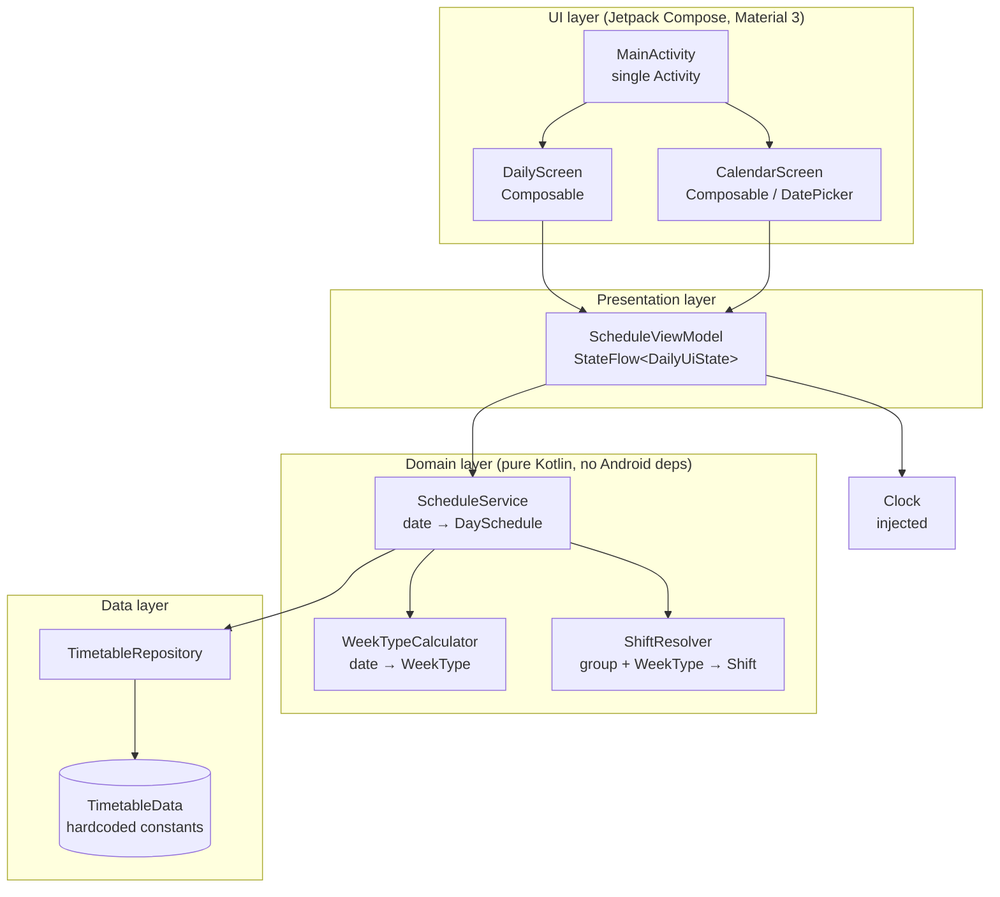

# Design Document

## Overview

This document describes the technical design for **school-timetable**, a single-user, fully offline native Android application that displays the personal teaching schedule of one primary school teacher ("Ostojic O."). The app runs on a personal Samsung Android device, is sideloaded (no Play Store, no account, no network), and for any selected calendar date shows the class/group codes taught per period together with the correct bell (clock) times.

The domain has two independent parts, mirrored directly in the design:

1. **A fixed weekly class layout.** The classes taught on each weekday never change from week to week. Weekdays are partitioned into two fixed groups: the *Parna group* (Monday, Thursday, Friday) and the *Neparna group* (Tuesday, Wednesday). (Requirement 5.1, 5.2)
2. **A weekly shift alternation.** Only the shift (morning vs afternoon) alternates. The two groups swap shifts each week. This is captured by a `WeekType` (A or B) computed deterministically from the date relative to the anchor Monday 2026-08-31. (Requirement 2)

For any date the app: resolves the weekday (which yields the fixed period list and the group), computes the `WeekType` (which decides whether that group is on morning or afternoon shift that week), and renders each period with its class code and the bell times of the resolved shift. (Requirement 2.7)

Because the timetable and bell times are small, fixed, and known at compile time, they are modeled as **in-code constant data** (Kotlin `object` domain tables) rather than a database. This choice is discussed in [Data source strategy](#data-source-strategy) and directly satisfies the "store locally / persist across restarts / works offline" requirements (Requirement 5.5, 5.6) with no I/O and no migration risk.

### Key design decisions

| Decision | Choice | Rationale |
| --- | --- | --- |
| Language / UI | Kotlin + Jetpack Compose, Material 3 | Modern standard native Android stack; declarative UI fits the small, state-driven screens. |
| Architecture | Single-Activity, MVVM (ViewModel + StateFlow / Compose state) | Clean separation of pure domain logic from UI; testable. |
| Date math | `java.time` (`LocalDate`, `DayOfWeek`) | Correct, well-tested week arithmetic; deterministic. |
| Data source | Hardcoded in-code constant tables | Fixed, tiny dataset; fully offline; trivially persistent; no DB/migration overhead. See [Data source strategy](#data-source-strategy). |
| Min / target SDK | `minSdk 26`, `targetSdk` latest stable | `java.time` available natively at API 26; covers modern Samsung phones. If `minSdk < 26` were needed, enable core library desugaring. |
| Localization | Serbian day/shift labels via string resources | Teacher-facing labels (Ponedeljak, Utorak, ПРЕПОДНЕВНА/ПОПОДНЕВНА СМЕНА). Kept simple. |

## Architecture

The app is a single Activity hosting a Compose navigation graph with two destinations (Daily view and Calendar view) that share one `ScheduleViewModel`. Business rules live in a pure domain layer with no Android dependencies, so they can be unit- and property-tested in isolation with an injected clock.



Flow for rendering a date:
1. `ScheduleViewModel` holds the `selectedDate` and asks `ScheduleService` for that date's schedule.
2. `ScheduleService` resolves the `DayGroup` from the weekday, calls `WeekTypeCalculator` for the `WeekType`, calls `ShiftResolver` to map (group, weekType) → `Shift`, fetches the fixed lessons and the shift's bell times from `TimetableRepository`, and returns a fully `ResolvedDaySchedule`.
3. The ViewModel maps that into a `DailyUiState` the Composables render.

## Components and Interfaces

### WeekTypeCalculator

Pure function computing the `WeekType` for any date relative to the anchor. No Android or clock dependency — the date is passed in. (Requirement 2.1–2.4)

```kotlin
object WeekTypeCalculator {
    /** Monday of the anchor week; defined as WeekType.A. (Requirement: Anchor_Week) */
    val ANCHOR_MONDAY: LocalDate = LocalDate.of(2026, 8, 31)

    /** WeekType is deterministic for a given date. (Requirement 2.1, 2.3) */
    fun weekTypeFor(date: LocalDate): WeekType

    /** Absolute count of whole Mon–Sun weeks between date's Monday and the anchor Monday. */
    fun weeksFromAnchor(date: LocalDate): Long
}
```

### ShiftResolver

Maps a group and week type to a shift. (Requirement 2.5, 2.6)

```kotlin
object ShiftResolver {
    fun shiftFor(group: DayGroup, weekType: WeekType): Shift
}
```

### TimetableRepository

Provides the fixed timetable and bell times from local constant data. Returns a `Result`-style outcome so the startup "data unavailable" path (Requirement 5.7) is representable even for hardcoded data.

```kotlin
interface TimetableRepository {
    /** Ordered lessons for a weekday, independent of WeekType. Empty for weekends. (Req 5.1, 5.2) */
    fun lessonsFor(dayOfWeek: DayOfWeek): List<Lesson>

    /** Bell times for a shift, keyed by period number. (Req 5.3, 5.4) */
    fun bellTimesFor(shift: Shift): Map<Int, BellTime>

    /** Verifies the constant tables are loadable/consistent at startup. (Req 5.7) */
    fun load(): TimetableLoadResult
}

sealed interface TimetableLoadResult {
    data object Available : TimetableLoadResult
    data class Unavailable(val reason: String) : TimetableLoadResult
}
```

### ScheduleService

Assembles a fully resolved schedule for a date by combining the fixed lessons with the resolved shift's bell times. (Requirement 1, 2.7, 2.8)

```kotlin
class ScheduleService(private val repository: TimetableRepository) {

    /** Full resolved schedule for one date: weekday, group, weekType, shift, and resolved lessons. */
    fun scheduleFor(date: LocalDate): DaySchedule
}
```

### ScheduleViewModel

Holds the selected date and exposes UI state. Takes an injected `Clock` so "today" is deterministic in tests. (Requirement 3, 4, 6.2, 6.4)

```kotlin
class ScheduleViewModel(
    private val scheduleService: ScheduleService,
    private val clock: Clock = Clock.systemDefaultZone()
) : ViewModel() {

    val uiState: StateFlow<DailyUiState>

    fun initToToday()          // Req 3.1, 6.2; falls back on failure per Req 6.4
    fun nextDay()              // Req 3.2
    fun previousDay()          // Req 3.3
    fun selectDate(date: LocalDate)   // Req 4.2
}
```

### Composable screens

- **`DailyScreen`** — renders `DailyUiState`: weekday + group label (Req 1.3), shift label (Req 1.4), ordered period rows with number, class code and times (Req 1.1, 1.2), pause rows (Req 1.5), weekend / no-class messages (Req 1.6, 1.7), and prev/next controls (Req 3.2, 3.3). (Requirement 1, 3)
- **`CalendarScreen`** — a Material 3 `DatePicker` (or month grid) defaulting to the selected date's month (Req 4.1), marking the selected date (Req 4.3), and returning the chosen date to the ViewModel (Req 4.2, 4.4, 4.5). (Requirement 4)

## Data Models

All domain types are plain Kotlin with no Android dependency.

```kotlin
enum class WeekType { A, B }

enum class DayGroup { PARNA, NEPARNA }

enum class Shift { MORNING, AFTERNOON }

/** A fixed lesson slot for a weekday. classCode == null means a Pause / free period. (Req 1.5, 5.1) */
data class Lesson(
    val period: Int,          // 1..7
    val classCode: String?    // e.g. "5/4"; null => Pause
) {
    val isPause: Boolean get() = classCode == null
}

/** Bell (clock) times for a period within a shift. (Req 5.3, 5.4) */
data class BellTime(
    val period: Int,
    val start: LocalTime,
    val end: LocalTime
)

/** A lesson combined with the resolved shift's bell times. (Req 1.1) */
data class ResolvedLesson(
    val period: Int,
    val classCode: String?,   // null => Pause
    val start: LocalTime,
    val end: LocalTime
) {
    val isPause: Boolean get() = classCode == null
}

/** Fully resolved schedule for one date. */
data class DaySchedule(
    val date: LocalDate,
    val dayOfWeek: DayOfWeek,
    val isWeekend: Boolean,
    val group: DayGroup?,           // null on weekends
    val weekType: WeekType,
    val shift: Shift?,              // null on weekends
    val lessons: List<ResolvedLesson> // empty on weekends / no-class weekdays
)
```

UI-facing state:

```kotlin
data class DailyUiState(
    val date: LocalDate,
    val headerLabel: String,        // localized weekday, e.g. "Ponedeljak"
    val groupLabel: String?,        // "Parna" / "Neparna"
    val shiftLabel: String?,        // ПРЕПОДНЕВНА / ПОПОДНЕВНА СМЕНА
    val lessons: List<ResolvedLesson>,
    val message: DailyMessage?      // WEEKEND, NO_CLASSES, DATA_UNAVAILABLE, DATE_UNDETERMINED
)

enum class DailyMessage { WEEKEND, NO_CLASSES, DATA_UNAVAILABLE, DATE_UNDETERMINED }
```

### Group membership (fixed)

```kotlin
val DAY_GROUP: Map<DayOfWeek, DayGroup> = mapOf(
    DayOfWeek.MONDAY    to DayGroup.PARNA,
    DayOfWeek.THURSDAY  to DayGroup.PARNA,
    DayOfWeek.FRIDAY    to DayGroup.PARNA,
    DayOfWeek.TUESDAY   to DayGroup.NEPARNA,
    DayOfWeek.WEDNESDAY to DayGroup.NEPARNA
    // Saturday, Sunday: no group (weekend)
)
```

### Hardcoded timetable (period → class code; null = Pause) — Requirement 5.2

```kotlin
object TimetableData {

    val LESSONS: Map<DayOfWeek, List<Lesson>> = mapOf(
        DayOfWeek.MONDAY to listOf(
            Lesson(6, "5/4"), Lesson(7, "5/2")
        ),
        DayOfWeek.TUESDAY to listOf(
            Lesson(2, "6/1"), Lesson(3, "8/5"), Lesson(4, "6/3"),
            Lesson(5, "6/5"), Lesson(6, "7/1"), Lesson(7, "7/5")
        ),
        DayOfWeek.WEDNESDAY to listOf(
            Lesson(1, "7/3"), Lesson(2, "5/3"), Lesson(3, "8/1"),
            Lesson(4, null),  Lesson(5, "6/7"), Lesson(6, "8/7")   // period 4 = Pause
        ),
        DayOfWeek.THURSDAY to listOf(
            Lesson(1, "6/4"), Lesson(2, "6/2"), Lesson(3, "6/6"),
            Lesson(4, "8/4"), Lesson(5, null),  Lesson(6, "7/4"),  // period 5 = Pause
            Lesson(7, "7/2")
        ),
        DayOfWeek.FRIDAY to listOf(
            Lesson(4, "7/6"), Lesson(5, "8/2"), Lesson(6, "8/6"), Lesson(7, "7/7")
        ),
        DayOfWeek.SATURDAY to emptyList(),
        DayOfWeek.SUNDAY to emptyList()
    )

    // Morning shift bell times. (Req 5.3)
    val MORNING_BELLS: Map<Int, BellTime> = mapOf(
        1 to BellTime(1, LocalTime.of(8, 0),  LocalTime.of(8, 45)),
        2 to BellTime(2, LocalTime.of(8, 50), LocalTime.of(9, 35)),
        3 to BellTime(3, LocalTime.of(9, 55), LocalTime.of(10, 40)),
        4 to BellTime(4, LocalTime.of(10, 45), LocalTime.of(11, 30)),
        5 to BellTime(5, LocalTime.of(11, 35), LocalTime.of(12, 20)),
        6 to BellTime(6, LocalTime.of(12, 25), LocalTime.of(13, 10)),
        7 to BellTime(7, LocalTime.of(13, 15), LocalTime.of(14, 0))
    )

    // Afternoon shift bell times. (Req 5.4)
    val AFTERNOON_BELLS: Map<Int, BellTime> = mapOf(
        1 to BellTime(1, LocalTime.of(14, 0),  LocalTime.of(14, 45)),
        2 to BellTime(2, LocalTime.of(14, 50), LocalTime.of(15, 35)),
        3 to BellTime(3, LocalTime.of(15, 55), LocalTime.of(16, 40)),
        4 to BellTime(4, LocalTime.of(16, 45), LocalTime.of(17, 30)),
        5 to BellTime(5, LocalTime.of(17, 35), LocalTime.of(18, 20)),
        6 to BellTime(6, LocalTime.of(18, 25), LocalTime.of(19, 10)),
        7 to BellTime(7, LocalTime.of(19, 15), LocalTime.of(20, 0))
    )
}
```

### Data source strategy

The requirements describe a *fixed* timetable and *fixed* bell times (Requirement 5.1–5.4) — the data never changes at runtime and there is no editing feature. Three options were considered:

- **Room database** — supports mutation and queries, but adds a schema, migrations, an I/O layer, and asynchronous access for data that is constant. Overkill; the persistence guarantee (Req 5.6) would depend on correct DB setup that could actually fail.
- **DataStore / preferences** — meant for small mutable key-value settings, not structured relational schedule data.
- **Hardcoded in-code constants (chosen)** — the tables live in `TimetableData` compiled into the APK. They are inherently offline (Req 5.5), survive restarts unchanged with zero effort (Req 5.6), and cannot be partially corrupted at runtime.

Because the data is compiled in, the "cannot be read at startup" path (Requirement 5.7) is minimal: it can only occur from a programming defect (e.g. a table failing an internal consistency assertion). `TimetableRepository.load()` runs a lightweight self-check (every non-weekend day has ≥1 lesson within periods 1–7, every referenced period has a bell time for both shifts) and returns `Unavailable` if the check fails, so the UI can show the data-unavailable indication rather than crash, while the compiled constants remain untouched (nothing to overwrite).

## Week type and shift resolution algorithm

### Computing WeekType (Requirement 2.1–2.4)

```kotlin
fun weeksFromAnchor(date: LocalDate): Long {
    // Monday of the given date's week (java.time weeks start Monday). (Req 2.2)
    val mondayOfDate = date.with(TemporalAdjusters.previousOrSame(DayOfWeek.MONDAY))
    // Absolute whole-week distance from the anchor Monday; handles dates before the anchor.
    val days = ChronoUnit.DAYS.between(ANCHOR_MONDAY, mondayOfDate) // may be negative
    return Math.floorDiv(days, 7).let { Math.abs(it) }             // absolute week count (Req 2.1)
}

fun weekTypeFor(date: LocalDate): WeekType =
    if (weeksFromAnchor(date) % 2 == 0L) WeekType.A else WeekType.B
```

Notes:
- Because both operands are Mondays, `days` is always a multiple of 7, so `floorDiv(days, 7)` is exact in both directions and equals the signed whole-week offset. Taking the absolute value gives an absolute week count that is symmetric around the anchor and defines the anchor week (offset 0) as `A`. (Requirement 2.1)
- The function depends only on `date`, so the same date always yields the same value. (Requirement 2.3)
- Two dates one week apart differ by exactly one in the week count, so their parity — and thus `WeekType` — is always opposite. (Requirement 2.4)

### Mapping to shift (Requirement 2.5, 2.6)

```kotlin
fun shiftFor(group: DayGroup, weekType: WeekType): Shift = when (weekType) {
    WeekType.A -> if (group == DayGroup.PARNA) Shift.MORNING else Shift.AFTERNOON
    WeekType.B -> if (group == DayGroup.PARNA) Shift.AFTERNOON else Shift.MORNING
}
```

### Assembling a day (Requirement 1, 2.7, 2.8)

```kotlin
fun scheduleFor(date: LocalDate): DaySchedule {
    val dow = date.dayOfWeek
    val weekType = WeekTypeCalculator.weekTypeFor(date)
    val isWeekend = dow == DayOfWeek.SATURDAY || dow == DayOfWeek.SUNDAY
    if (isWeekend) {
        return DaySchedule(date, dow, true, group = null, weekType, shift = null, lessons = emptyList())
    }
    val group = DAY_GROUP.getValue(dow)
    val shift = ShiftResolver.shiftFor(group, weekType)
    val bells = repository.bellTimesFor(shift)              // Req 2.7 applies shift bell times
    val lessons = repository.lessonsFor(dow)               // fixed, WeekType-independent (Req 2.8)
        .sortedBy { it.period }                            // ascending order (Req 1.2)
        .map { l ->
            val b = bells.getValue(l.period)
            ResolvedLesson(l.period, l.classCode, b.start, b.end)
        }
    return DaySchedule(date, dow, false, group, weekType, shift, lessons)
}
```

The class codes come only from `repository.lessonsFor(dow)`, which does not depend on `weekType`; only `bells` depends on the resolved shift. This structurally guarantees Requirement 2.8 (class codes identical across week types; only times differ).

## Daily view behavior

- **Default to today.** On launch the ViewModel sets `selectedDate` to `LocalDate.now(clock)` and renders that date within the launch budget. (Requirement 3.1, 6.2)
- **Navigation.** `nextDay()` / `previousDay()` shift `selectedDate` by ±1 day and recompute the full `DaySchedule`, updating periods, class codes, shift times, and the weekday/group/shift labels. (Requirement 3.2, 3.3, 3.4)
- **Weekend.** When the resolved date is Saturday or Sunday, the view shows a "no classes scheduled" message and omits the period list, while retaining the selected date. (Requirement 1.6, 3.5, 6.3)
- **Weekday with no periods.** If a weekday has an empty lesson list, the view shows the no-classes message. (Requirement 1.7) (With the current fixed data all of Mon–Fri have periods, but the branch is handled generically.)
- **Pause.** Pause periods (`classCode == null`) render with their period number and clock times plus a visible "no class / pause" indication, in order among the other periods. (Requirement 1.5)
- **Labels.** The header shows the localized weekday and the group (Parna/Neparna); a separate label shows morning vs afternoon shift. (Requirement 1.3, 1.4)

## Calendar browsing behavior

- Opening the calendar shows a Material 3 date picker defaulting to the month of the current `selectedDate`. (Requirement 4.1)
- The currently selected date is visually marked. (Requirement 4.3)
- Selecting a date sets `selectedDate` and returns to the Daily view for that date, computed synchronously in-memory (well within the 1-second budget). (Requirement 4.2)
- The Daily view then shows the weekday, group, and shift label for the chosen date; a weekend selection shows the no-classes message and retains the date. (Requirement 4.4, 4.5)

## Correctness Properties

*A property is a characteristic or behavior that should hold true across all valid executions of a system — essentially, a formal statement about what the system should do. Properties serve as the bridge between human-readable specifications and machine-verifiable correctness guarantees.*

The domain layer (WeekType calculation, shift resolution, schedule assembly, and the constant data source) consists of pure functions over dates and small enums, making it well suited to property-based testing. Each property below is universally quantified and can be encoded directly as a PBT test with a generator over `LocalDate` (and over `DayGroup`/`WeekType` where relevant).

### Property 1: WeekType is deterministic and follows even/odd week parity

*For any* `LocalDate`, `weekTypeFor(date)` returns `A` when `weeksFromAnchor(date)` is even and `B` when it is odd, and repeated computations for the same date (including from freshly constructed instances) always return the same value. The anchor Monday 2026-08-31 and every date in its Mon–Sun week are `A`.

**Validates: Requirements 2.1, 2.3**

### Property 2: Dates in the same Monday–Sunday week share one WeekType

*For any* `LocalDate` and any day offset in `0..6` that keeps the date within the same Monday-to-Sunday week, both dates yield the same `WeekType`.

**Validates: Requirements 2.2**

### Property 3: Consecutive weeks alternate WeekType

*For any* `LocalDate`, `weekTypeFor(date)` and `weekTypeFor(date.plusWeeks(1))` are different (one `A`, one `B`).

**Validates: Requirements 2.4**

### Property 4: Shift resolution and bell-time application are correct

*For any* Monday-through-Friday `LocalDate`, letting `group = DAY_GROUP[dayOfWeek]` and `wt = weekTypeFor(date)`: the resolved shift equals `MORNING` exactly when (`group == PARNA` and `wt == A`) or (`group == NEPARNA` and `wt == B`), otherwise `AFTERNOON`; and every `ResolvedLesson`'s `start`/`end` equal the `BellTime` of that period for the resolved shift.

**Validates: Requirements 2.5, 2.6, 2.7, 1.1**

### Property 5: Class codes are invariant across WeekTypes; only times change

*For any* Monday-through-Friday weekday, the ordered sequence of `classCode` values in the resolved schedule is identical whether the date falls in a `WeekType.A` week or a `WeekType.B` week, while the set of clock times differs between the two.

**Validates: Requirements 2.8**

### Property 6: Group membership is fixed

*For any* Monday-through-Friday `LocalDate`, the resolved `DaySchedule.group` equals the fixed `DAY_GROUP` mapping for that weekday (Monday/Thursday/Friday → Parna, Tuesday/Wednesday → Neparna), independent of the date's week.

**Validates: Requirements 1.3**

### Property 7: Resolved lessons are ascending and preserve pauses

*For any* Monday-through-Friday `LocalDate`, the resolved lessons are ordered by strictly ascending period number, and every resolved lesson whose source `classCode` is `null` has `isPause == true` while still carrying valid `start`/`end` times.

**Validates: Requirements 1.2, 1.5**

### Property 8: Weekend days yield no lessons

*For any* `LocalDate` that is a Saturday or Sunday, the resolved `DaySchedule` has `isWeekend == true`, an empty `lessons` list, and a null `group`/`shift`.

**Validates: Requirements 1.6, 3.5, 4.5, 6.3**

### Property 9: Day navigation round-trips to the same schedule

*For any* starting `LocalDate`, advancing one day and then going back one day (or the reverse) returns a `DaySchedule` equal to the original date's schedule; a single `nextDay`/`previousDay` step produces exactly the schedule of `date ± 1` with matching weekday, group, and shift.

**Validates: Requirements 3.2, 3.3, 3.4, 4.2**

### Property 10: Timetable data reads are idempotent

*For any* `DayOfWeek` (and any `Shift`), repeated calls to `lessonsFor` (and `bellTimesFor`), including across freshly constructed repository instances, return equal results — modeling that the stored data survives restarts unchanged.

**Validates: Requirements 5.6**

## Error Handling

| Condition | Detection | Handling | Requirement |
| --- | --- | --- | --- |
| System date cannot be determined at launch | `initToToday()` catches an exception from reading `LocalDate.now(clock)` | Set a `DATE_UNDETERMINED` indication and default `selectedDate` to the most recent weekday (Mon–Fri) on/before the last known date; render its Daily view | 6.4 |
| Selected date is a weekend | `dayOfWeek` is Saturday/Sunday | Show `WEEKEND` no-classes message, omit the period list, retain the selected date | 1.6, 3.5, 4.5, 6.3 |
| Weekday has no period entry | Empty lesson list for the weekday | Show `NO_CLASSES` message | 1.7 |
| Timetable/bell data cannot be read at startup | `TimetableRepository.load()` self-check returns `Unavailable` | Show `DATA_UNAVAILABLE` indication; do not overwrite the constant data (nothing to persist/lose) | 5.7 |

Guiding principles:
- The domain layer never throws for ordinary inputs — weekends and empty weekdays are represented as valid `DaySchedule` states, not errors.
- Only genuinely exceptional conditions (clock failure, failed data self-check) produce a `DailyMessage` error indication, and each keeps the app usable rather than crashing (Requirement 6.2 launch must still succeed).

## Testing Strategy

A dual approach: property-based tests verify the universal domain rules; example/unit tests pin down concrete data values and specific branches; Compose UI tests verify rendering.

**Property-based tests (domain layer).** Use **Kotest property testing** (`io.kotest:kotest-property`) with a custom `Arb<LocalDate>` generator spanning a wide range around the anchor (including dates well before 2026-08-31 to exercise the absolute-week-count path). Each property test:
- runs a minimum of **100 iterations** (Kotest default iterations configured to ≥100),
- is tagged with a comment referencing its design property, format: `// Feature: school-timetable, Property {number}: {property_text}`,
- implements exactly one Correctness Property (Properties 1–10 above) as a single property test.
Dates are the primary generated input; `DayGroup`/`WeekType` are generated via `Arb.enum(...)` for the pure mapping in Property 4. No PBT library is implemented from scratch.

**Unit / example tests (data and branches).**
- Table-driven tests asserting `TimetableData.LESSONS`, `MORNING_BELLS`, and `AFTERNOON_BELLS` match the specified values exactly (Requirements 5.1–5.4).
- Weekday-with-no-periods branch via a stub repository returning an empty list → `NO_CLASSES` (Requirement 1.7).
- Startup data-unavailable via a stub repository returning `Unavailable` → `DATA_UNAVAILABLE`, constants untouched (Requirement 5.7).
- Launch behavior with an injected fixed `Clock`: today's date is selected and rendered (Requirements 3.1, 6.2); a weekend clock shows the weekend message (Requirement 6.3); a throwing clock triggers `DATE_UNDETERMINED` and defaults to the most recent weekday (Requirement 6.4).

**Compose UI tests (`createComposeRule`).**
- Daily screen renders period rows with number/class code/times, the weekday+group label, the shift label, and a pause indication for pause periods (Requirements 1.1, 1.3, 1.4, 1.5).
- Prev/next controls change the displayed date (Requirements 3.2, 3.3).
- Calendar defaults to the selected date's month, marks the selected date, and returns the chosen date to the Daily view (Requirements 4.1, 4.2, 4.3, 4.4).

**Determinism in tests.** All time-dependent behavior is driven by an injected `Clock` (or explicit `LocalDate` parameters), so "today", navigation, and weekend detection are fully reproducible. The domain functions take dates as parameters and hold no hidden state.

**Non-functional notes (not property-tested).** The 1-second date-selection budget (Requirement 4.2) and 3-second launch budget (Requirement 6.2) are met inherently by in-memory computation over constant data; they are observed in UI tests rather than asserted as properties. Offline operation (Requirement 5.5) and standalone installability (Requirements 6.1) are covered by a build/install smoke check and the absence of any network permission in the manifest.
